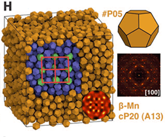

# dodecahedron benchmark

The dodecahedron benchmark runs a fluid of dodecahedra using hard particle Monte Carlo.
This is a synthetic benchmark of 3D convex polyhedra performance.



Parameters:

* $N = $ *variable*
* Hard particle Monte Carlo
    * Vertices: *see dodecahdron/bmark.py*
    * $d = 0.3$
    * $a = 0.26$
    * density $\phi = 0.5$
    * $n_\mathrm{select} = 4$

How to run:

1. Choose a number of particles along one edge of the simple cubic lattice for initialization, e.g.
$n=50$, which initializes $N=n^3=125000$ particles.

```
python init.py 50
```

2. Add your execution configuration to the list in `init_exec_confs.py`:

    **mode** (str): either **gpu** or **cpu**

    **gpu_ids** (list): list of GPUs per MPI rank to execute on, e.g. `0` or `0,1,2`

    **nranks** (int): Number of MPI ranks for domain decomposition

    Then, execute

    ```
    python init_exec_confs.py
    ```

3. Equilibrate, if necessary, and execute benchmark on a workstation or compute node, or submit cluster job

    ```
    mpirun -np <number of ranks> python project.py run # executes all pending operations
    ```

    or

    ```
    python project.py submit # submit pending operations to cluster
    ```

    The output is stored in the [signac job document](https://docs.signac.io/en/latest/projects.html), in a `dict` entry with
    the name of the execution configuration as key (e.g., `gpu_nranks1`). Inspect with

    ```
    signac document
    ```

