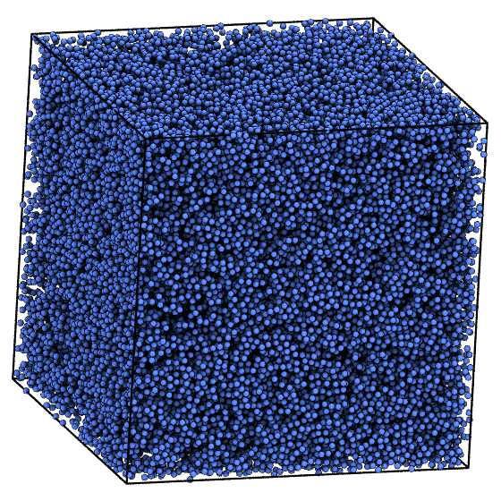

# lj-liquid benchmark

The Lennard-Jones liquid benchmark is a classic benchmark for general-purpose
MD simulations. It is representative of the performance HOOMD-blue achieves
with straight pair potential simulations.



Parameters:

* $N = $ *variable*
* $\rho = 0.382$
* Lennard-Jones pair force
    * $r_\mathrm{cut} = 3.0$
    * $\epsilon = 1.0$
    * $\sigma = 1.0$
    * $\delta t = 0.005$
* Integration: Nos&eacute;-Hoover NVT
    * $T=1.2$
    * $\tau=0.5$

How to run:

1. Choose a number of particles along one edge of the simple cubic lattice for initialization, e.g.
$n=40$, which initializes $N=n^3=64000$ particles.

```
python init.py 40
```

2. Add your execution configuration to the list in `init_exec_confs.py`:
    **mode** (str): either **gpu** or **cpu**
    **gpu_ids** (list): list of GPUs per MPI rank to execute on, e.g. `0` or `0,1,2`
    **nranks** (int): Number of MPI ranks for domain decomposition

    Then, execute

    ```
    init_exec_confs.py
    ```

3. Equilibrate, if necessary, and execute benchmark on a workstation or compute node, or submit cluster job

    ```
    mpirun -np <number of ranks> python project.py run # executes all pending operations
    ```

    or

    ```
    python project.py submit # submit pending operations to cluster
    ```

    The output is stored in the [signac job document](https://docs.signac.io/en/latest/projects.html), in a `dict` entry with
    the name of the execution configuration as key (e.g., `gpu_nranks1`). Inspect with

    ```
    signac document
    ```
