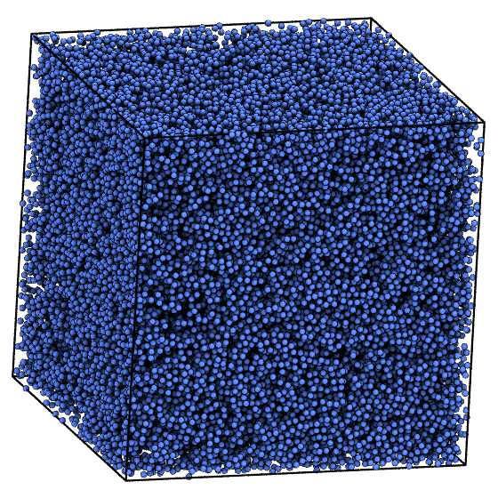

# lj-liquid benchmark

The Lennard-Jones liquid benchmark is a classic benchmark for general-purpose
MD simulations. It is representative of the performance HOOMD-blue achieves
with straight pair potential simulations.



Parameters:

* $N = $ *variable*
* $\rho = 0.382$
* Lennard-Jones pair force
    * $r_\mathrm{cut} = 3.0$
    * $\epsilon = 1.0$
    * $\sigma = 1.0$
    * $\delta t = 0.005$
* Integration: Nos&eacute;-Hoover NVT
    * $T=1.2$
    * $\tau=0.5$

## How to add a new statepoint to the database:

1. Choose a number of particles along one edge of the simple cubic lattice for initialization, e.g.
$n=100$, which initializes $N=n^3=1000000$ particles.

```
python init.py 100
```

2. Equilibrate. Login to the compute node, then

    ```
    python ../project.py run -o lj_liquid-equilibrate
    ```
