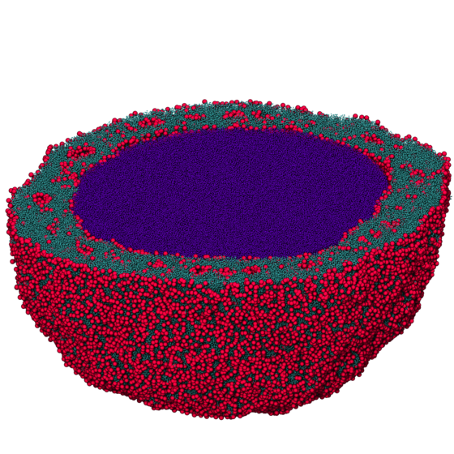

# microsphere benchmark

The microrsphere benchmark runs a system of star polymers in an explicit solvent using DPD.
These organize into a microspherical droplet. This model is used in the research article:
[Zhang et. al. Simultaneous Nano- and Microscale Control of Nanofibrous Microspheres Self-Assembled from Star-Shaped Polymers. Advanced Materials, pages 3947–3952 , 2015.](http://dx.doi.org/10.1002/adma.201501329)



Parameters:

* $N = 1,428,364$
* $r_\mathrm{cut} = 1.0$
* DPD pair force
    * See `bmark.py` for full force field specification.
* Harmonic bond force
* Integration: DPD thermostat
    * $T=1.0$
    * $\delta t = 0.01$

How to run:

1. Add your execution configuration to the list in `init_exec_confs.py`:

    **mode** (str): either **gpu** or **cpu**

    **gpu_ids** (list): list of GPUs per MPI rank to execute on, e.g. `0` or `0,1,2`

    **nranks** (int): Number of MPI ranks for domain decomposition

    Then, execute

    ```
    python init_exec_confs.py
    ```

2. Equilibrate, if necessary, and execute benchmark on a workstation or compute node, or submit cluster job

    ```
    mpirun -np <number of ranks> python project.py run # executes all pending operations
    ```

    or

    ```
    python project.py submit # submit pending operations to cluster
    ```

    The output is stored in the [signac job document](https://docs.signac.io/en/latest/projects.html), in a `dict` entry with
    the name of the execution configuration as key (e.g., `gpu_np1`). Inspect with

    ```
    signac document
    ```

