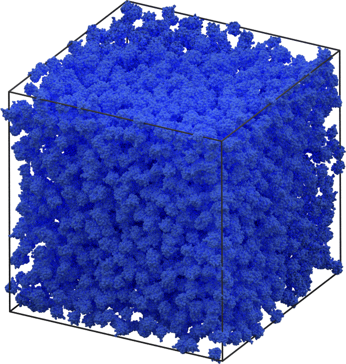

# Patchy protein benchmark

We simulate a rigid, atomistic model of the rubredoxin protein (PDB 1BRF) with a patch configuration that leads to crystallization.
For details of the model, see Glaser and Glotzer, *under review (2019)*.



Parameters:

* $N = $ *variable*
* $\epsilon_c = 0.33$
* $\delta t$ = 0.005
* $\phi$ = 0.25
* $\epsilon_l = 0$ (purely specific interactions)
* Integration: Nos&eacute;-Hoover NVT
    * $\T = 1$
    * $\tau=1$ 

## How to add a new statepoint to the database:

1. Choose a number of proteins along one edge of the simple cubic lattice for initialization, e.g.
$n=16$, which initializes $N=n^3=4096$ particles.

```
python init.py 16
```

2. Equilibrate. Login to the compute node, then

    ```
    python ../project.py run -o patchy_protein-equilibrate
    ````
