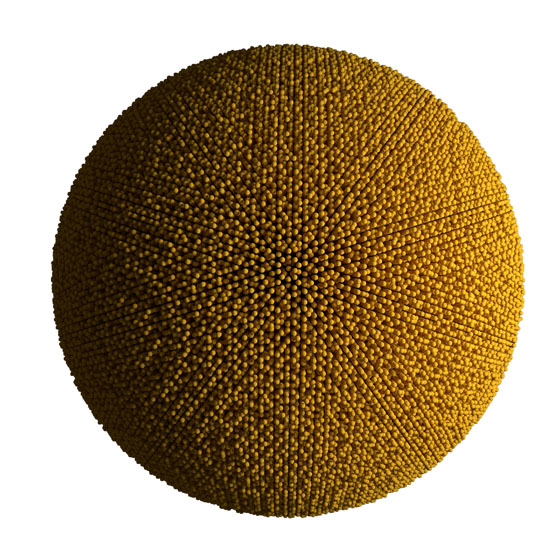

# quasicrystal benchmark

The quasicrystal benchmark runs a system of particles with an oscillatory pair potential that forms an icosahedral
quasicrystal. This model is used in the research article:
[Engel M, et. al. (2015) Computational self-assembly of a one-component icosahedral quasicrystal, Nature materials 14(January), p. 109-116,](http://dx.doi.org/10.1038/NMAT4152)



Parameters:

* $N = $ *variable*
* $\rho = 0.03$
* Tabulated pair force
    * $$V = \frac{1}{r^{15}} + \frac{\cos(k (r - 1.25) - \phi)}{r^3}$$
    * $k = 6.25$
    * $\phi = 0.62$
* Integration: Nos&eacute;-Hoover NVT
    * $T=0.18$
    * $\tau=1.0$
    * $\delta t = 0.01$

## How to add a new statepoint to the database:

1. Choose a number of particles along one edge of the simple cubic lattice for initialization, e.g.
$n=100$, which initializes $N=n^3=1,000,000$ particles.

```
python init.py 100
```

2. Equilibrate. Login to the compute node, then

    ```
    python ../project.py run -o quasicrystal-equilibrate
    ```
