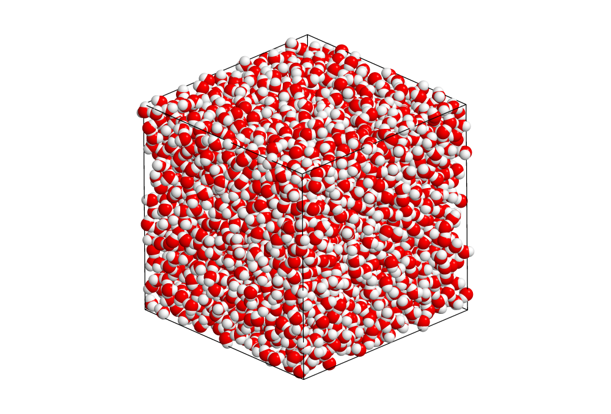

# SPC/E water benchmark

The SPC/E water tests performance of the extended simple point charge model for liquid water. It uses rigid bodies
and PPPM electrostatics. PPPM is not comparable in performance to more optimized methods not yet implemented
in HOOMD-blue such as PME (used by GROMACS), therefore absolute performance of this benchmark could be improved.



Parameters:

* $N = $ *variable*
* $\rho = 994$ kg m^-3
* $\delta t = 0.002$ fs
* PPPM fourier spacing $\delta l = 0.08$ nm
* Integration: Nos&eacute;-Hoover NVT
    * $\T = 300$ K
    * $\tau=1$ ps

How to run:

1. Choose a number of particles along one edge of the simple cubic lattice for initialization, e.g.
$n=32$, which initializes $N=n^3=32768$ water molecules.

```
python init.py 32
```

2. Add your execution configuration to the list in `init_exec_confs.py`:

    **mode** (str): either **gpu** or **cpu**

    **gpu_ids** (list): list of GPUs per MPI rank to execute on, e.g. `0` or `0,1,2`

    **nranks** (int): Number of MPI ranks for domain decomposition

    Then, execute

    ```
    python init_exec_confs.py
    ```

3. Equilibrate, if necessary, and execute benchmark on a workstation or compute node, or submit cluster job

    ```
    mpirun -np <number of ranks> python project.py run # executes all pending operations
    ```

    or

    ```
    python project.py submit # submit pending operations to cluster
    ```

    The output is stored in the [signac job document](https://docs.signac.io/en/latest/projects.html), in a `dict` entry with
    the name of the execution configuration as key (e.g., `gpu_np1`). Inspect with

    ```
    signac document
    ```
